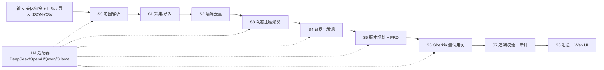

# App Review Insights — 实施计划与架构

> 项目根目录：`D:\Users\Administrator\Documents\agent_demo`
> 评估书要求对照：[docs/EVALUATION.md](docs/EVALUATION.md)
> 模型与防幻觉：[docs/AI.md](docs/AI.md)

## 1. 目标

构建一个可运行的 App Store 评论分析工具：用户输入美国区 App Store 链接与分析目标，
点击 Start 后自动完成「采集 → 清洗 → 动态分类 → 证据评估 → 版本规划/PRD → 测试用例 →
追溯校验」，并在 UI 中展示进度、中间产物与最终交付物。所有结论可追溯到具体评论，
且不依赖任何 app 专属硬编码。

## 2. 可验收要求清单

| 编号 | 要求 | 验收证据 |
| --- | --- | --- |
| R1 | 可运行 Web 应用，输入美区链接 + 目标/约束，Start 自动跑完整工作流 | `python app/server.py` 端到端跑通示例 app |
| R2 | 不依赖 app 专属硬编码的分类/发现/需求/测试 | 换未见 app/数据集仍产出 |
| R3 | 完整工作流：范围→采集→清洗→分类→证据→PRD→用例→追溯 | 每个阶段有中间产物 |
| R4 | 至少一个核心语义任务运行时模型驱动 | S0/S3/S4/S5/S6 均调用 LLM |
| R5 | 规则/统计/模型分工明确并说明理由 | 本文档第 7 节 + docs/AI.md |
| R6 | 发现含来源评论、样本数、置信度/不确定性/冲突，统计与模型可区分 | `provenance` 等字段 + UI 徽章 |
| R7 | 文档化模型/供应商、prompt、配置、失败处理、防幻觉 | docs/AI.md |
| R8 | 密钥走环境变量，不入仓库 | `.env.example` 占位，git 无密钥 |
| R9 | GitHub 项目、本地可运行、源码/运行/采集说明/缓存样例 | README + data/ |
| R10 | 支持 JSON/CSV 导入；未见输入也有依据地产出 | 导入入口 + 场景测试 |
| R11 | 完整 commit 历史体现迭代 | 40+ 次提交 |

## 3. 总体架构



- **前端**：原生 HTML/CSS/JS（亮色全息主题），轮询 `/api/status`，渲染 8 个交付物 Tab。
- **后端**：Python 标准库 `http.server`，后台线程执行流水线，REST API 提供状态与产物。
- **流水线**：阶段状态机 + 每阶段 JSON 缓存，断点续跑；目标变化自动失效相关缓存。
- **存储**：JSON 信封文件（百条级数据可复现、可审计）。
- **模型**：OpenAI 兼容适配器，默认 DeepSeek，失败自动降级确定性模式。

## 4. 技术选型与理由

| 层 | 推荐方案 | 实际落地 | 理由 |
| --- | --- | --- | --- |
| 后端 | FastAPI + uvicorn | 标准库 `http.server` | 零依赖，评审环境直接 `python app/server.py` |
| 前端 | React + Vite | 原生 HTML/CSS/JS | 无需 npm install，交付即用 |
| 存储 | SQLite + SQLAlchemy | JSON 信封文件 | 数据百条级，可复现可审计，断点续跑 |
| 嵌入 | sentence-transformers | TF-IDF（可切换） | 离线、零依赖、中英混合可用 |
| 聚类 | HDBSCAN | KMeans + 轮廓系数选 k | 无需预定义主题数，纯标准库实现 |
| 采集 | httpx + US RSS | urllib + 美区 itml | 官方接口稳定，无需第三方依赖 |
| LLM | OpenAI 兼容适配器 | DeepSeek（可切） | 便宜、中英混合好、防厂商锁定 |
| 结构化输出 | Pydantic + JSON Schema | JSON 校验 + 重试 | 强制字段、降低幻觉、失败可重试 |
| 测试 | pytest + Playwright | 标准库 unittest | 零依赖，76 个用例全过 |
| 图表 | Recharts / ECharts | Canvas2D / SVG / CSS 自绘 | 保持零依赖，按需实现 |

## 5. 数据策略（美国区优先）

- **元数据**：`https://itunes.apple.com/lookup?id=<id>&country=us`。
- **评论**：`https://itunes.apple.com/WebObjects/MZStore.woa/wa/userReviewsRow`（美区 `X-Apple-Store-Front`）。
- **已知限制**：该接口固定返回 10 条热门评论，不返回评论版本号；旧版美区 RSS 已停用，
  AMP token 当前不可获取。限制写入 `collection_notes.json` 并如实展示。
- **导入兜底**：支持 JSON/CSV；字段别名见 README；导入后可继续跑分析。
- **数量规则**：不足 200 条全量使用；超过 200 条只取前 200 条。
- **合规与限速**：只用官方公共接口；请求间隔 ≥ 1 秒；信封缓存；绝不编造评论。

## 6. 九阶段流水线

| 阶段 | 输入 | 方法 | 输出 | 校验点 |
| --- | --- | --- | --- | --- |
| S0 范围 | 目标文本 | 规则种子 + LLM 抽取 | `scope` | 非法值回退全量 |
| S1 采集/导入 | 链接/数据集 | 规则：接口/分页/限速/缓存/导入 | `raw` | 来源可溯 |
| S2 清洗 | 原始评论 | 规则：去重/规范化/垃圾/PII/语言 | `clean` | 去重率统计 |
| S3 主题 | 清洗评论 | TF-IDF + KMeans + LLM 命名 | `topics` | 动态分类无硬编码 |
| S4 发现 | 主题+评论 | 统计兜底 + LLM 生成 + 白名单 | `findings` | 每条 ≥1 评论引用 |
| S5 需求 | 发现 | LLM + 引用过滤/回填 | `requirements` | 可追溯到发现/评论 |
| S6 用例 | 需求 | LLM Gherkin + 引用过滤/回填 | `testcases` | 链接需求与评论 |
| S7 溯源 | 全链路对象 | 确定性图遍历 + 修订 | `traceability` | 删除/假设/拦截记录 |
| S8 汇总 | 各阶段产物 | 规则组装 | `summary` + UI | 限制与不确定性明示 |

## 7. 规则 / 统计 / 模型分工与防幻觉

- **规则承担**：采集、分页、限速、缓存、导入、去重、规范化、垃圾过滤、PII、语言识别、图遍历校验。
- **统计承担**：评分/语言分布、样本数、冲突检测、置信度钳制。
- **模型承担**：范围抽取、主题命名、发现生成、需求/版本规划、测试用例生成、追问与挑战。

防幻觉四层：

1. 引用白名单：模型只能引用输入的 review_id/finding_id，输出后集合校验，非法丢弃并记录 `dropped_refs`；
2. 结构化输出：JSON 校验 + 失败重试；
3. 低温度 + 硬性提示词（证据不足降置信、冲突必列）；
4. S7 确定性兜底：无支持发现删除、无证据需求标 assumption、悬空用例移除。

## 8. 可追溯性设计

- ID 体系：`review_id → finding(id) → requirement(code) → test_case(code)`。
- UI 证据双向跳转：点击证据 chip 查看原文；评论 ID 可反查引用它的发现与需求。
- S7 输出四类检查：发现证据 / 需求支撑 / 用例关联 / 需求评论链，逐项通过/失败。
- 拦截记录：`traceability.dropped_refs` 在溯源 Tab 可见。

## 9. 数据模型与文件结构

```text
data/raw/<app_id>/         app.json / reviews-*.json / collection_notes.json / imported-reviews.json
data/processed/<app_id>/   reviews_clean.json|csv / stats.json
                           analysis/{scope,clean,topics,findings,requirements,testcases,traceability,summary,progress}.json
```

每个缓存带 `url` + `fetched_at` 信封；每个阶段独立落盘，支持断点续跑与离线评审。

## 10. UI 信息架构

- 首页：美区链接 + 目标 + 导入 + Start；S0–S8 流水线条。
- 进度：阶段状态流。
- 结果 Tab：摘要 / 原始评论 / 主题聚类 / 关键发现 / 需求 PRD / 验收用例 / 溯源校验 / 数据清洗。
- 摘要：KPI、评分环形图、语言分布、分析范围、运行模式、说明、溯源通过率。
- 发现：置信度排序 + 三档色带、低置信折叠、证据弹窗、追问/挑战。
- 需求：版本甘特 + PRD 评审（接受/假设/删除 + 批注）。
- 溯源：SVG 全链路图 + 检查列表 + 白名单拦截记录。
- 全局：S0–S8 侧栏、星级/语言/版本筛选、演示模式、Markdown/JSON 导出。

## 11. 里程碑与当前状态

| 阶段 | 内容 | 状态 |
| --- | --- | --- |
| M0 | 仓库骨架、目录、`.env.example`、CI | ✅ |
| M1 | 采集/导入/清洗（美区优先 + 200 上限） | ✅ |
| M2 | 动态主题 + 证据化发现 | ✅ |
| M3 | PRD / 版本拆分 / 用例 / 追溯校验 | ✅ |
| M4 | 零依赖 Web UI | ✅ |
| M5 | 场景测试、自检、GitHub 推送 | ✅ |
| P1 | 环形图/置信度带/证据跳转/低置信折叠/拦截日志/导出 | ✅ |
| P2 | 气泡图/溯源图/甘特/侧栏/全局筛选/PRD 评审/演示模式/追问挑战 | ✅ |
| P3 | 交付文档（README/EVALUATION/PLAN）+ 自检 + 推送 | ✅ |

## 12. 风险与对策

| 风险 | 对策 |
| --- | --- |
| 美区评论接口只返回 10 条且无版本号 | 如实声明限制；支持导入合规美区数据集补充 |
| LLM 幻觉/无依据结论 | 白名单 + JSON 校验 + 低温度 + S7 兜底 + 拦截日志 |
| 模型服务故障 | 重试 + 降级确定性模式 + UI 明确标注 |
| 数据不足 | 低置信折叠、样本边界声明，不编造 |
| 评审换链接/数据集/目标 | 全动态流水线 + 导入 + 场景测试 |
| 密钥泄露 | `.env` 不入库，CI 用 secrets |

## 13. 已知限制与下一步

1. 美区公开接口当前只能自动获取 10 条热门评论；需导入合规数据集才能扩大美区样本。
2. TF-IDF + KMeans 为离线轻量方案，可切换 sentence-transformers + HDBSCAN。
3. 数据量为百条级，使用 JSON 文件；规模化后可平移 SQLite。
4. 前端轮询可升级 SSE；追问/挑战目前依赖已配置的 LLM。
