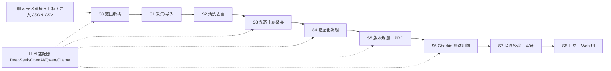

# App Review Insights

把真实的 App Store 用户评论，自动转化为**可追溯的产品需求（PRD）、版本规划和测试用例**，
并通过一个**零第三方依赖、本地一键运行的 Web UI** 展示完整分析流程。

评估用主样例：

```text
https://apps.apple.com/us/app/workout-for-women-home-gym/id839285684
```

> 本项目的目标与验收标准来自 LaienTech 评估书。评估书逐项要求对照见
> [docs/EVALUATION.md](docs/EVALUATION.md)；模型、提示词与防幻觉设计见 [docs/AI.md](docs/AI.md)。

## 1. 项目目标

构建一个可运行的 App Store 评论分析工具：用户输入美国区 App Store 链接与分析目标，
点击 Start 后自动完成「范围 → 采集 → 清洗 → 动态分类 → 证据评估 → 版本规划/PRD →
测试用例 → 追溯校验」，并在 UI 中展示进度、中间产物与最终交付物。
所有结论可追溯到具体评论，且不依赖任何 app 专属硬编码。

## 2. 能做什么

1. 在 UI 中输入一个**有效的美国区 App Store 链接**，可选填分析目标/约束
   （如「订阅转化与付费墙体验」「低分评论」「指定版本」），点击「开始分析」。
2. 系统自动完成 10 步工作流：
   **范围解析 → 采集/导入 → 清洗去重 → 动态分类 → 证据评估 → 版本规划/PRD →
   测试用例 → 追溯校验 → 进度展示 → 交付物展示**。
3. 所有分类、发现、需求、用例都由当前数据动态生成，**没有任何 app 专属硬编码**。
4. 每条发现都带证据评论 ID、样本数、置信度、不确定性、冲突，并区分
   「确定性统计 / 模型生成 / 假设 / 已移除」。
5. 支持导入合规的 JSON/CSV 评论数据集，换链接、换数据集、换目标都能运行。
6. 未配置 LLM 时自动降级为确定性模式并明确标注，绝不伪装成功。

## 3. 可验收要求清单

| 编号 | 要求 | 验收证据 |
| --- | --- | --- |
| R1 | 可运行 Web 应用，输入美区链接 + 目标/约束，Start 自动跑完整工作流 | `python app/server.py` 端到端跑通示例 app |
| R2 | 不依赖 app 专属硬编码的分类/发现/需求/测试 | 换未见 app/数据集仍产出 |
| R3 | 完整工作流：范围→采集→清洗→分类→证据→PRD→用例→追溯 | 每个阶段有中间产物 |
| R4 | 至少一个核心语义任务运行时模型驱动 | S0/S3/S4/S5/S6 均调用 LLM |
| R5 | 规则/统计/模型分工明确并说明理由 | 本文档第 9 节 + docs/AI.md |
| R6 | 发现含来源评论、样本数、置信度/不确定性/冲突，统计与模型可区分 | `provenance` 等字段 + UI 徽章 |
| R7 | 文档化模型/供应商、prompt、配置、失败处理、防幻觉 | docs/AI.md |
| R8 | 密钥走环境变量，不入仓库 | `.env.example` 占位，git 无密钥 |
| R9 | GitHub 项目、本地可运行、源码/运行/采集说明/缓存样例 | 本文档 + data/ |
| R10 | 支持 JSON/CSV 导入；未见输入也有依据地产出 | 导入入口 + 场景测试 |
| R11 | 完整 commit 历史体现迭代 | git log（50+ 次提交） |

## 4. 快速开始

需要 Python 3.10+，运行阶段**零第三方依赖**（纯标准库 + 原生 HTML/CSS/JS）。

```bash
# 1) 采集元数据与评论（美国区官方接口，示例 app）
PYTHONPATH=src python scripts/fetch_reviews.py 839285684 --country us --method itml

# 2) 或导入已有 JSON/CSV 评论数据集
PYTHONPATH=src python scripts/import_reviews.py path/to/reviews.csv --app-id 839285684

# 3) 清洗去重，输出 data/processed/<app_id>/
PYTHONPATH=src python scripts/clean_reviews.py 839285684

# 4) 运行完整分析流水线（S0 → S8）
PYTHONPATH=src python scripts/analyze.py 839285684 --goal "订阅转化与付费墙体验"

# 5) 运行测试与一键自检
PYTHONPATH=src python -m unittest discover -s tests -v   # 76 个用例
python scripts/self_check.py

# 6) 启动 Web UI
python app/server.py --port 8765
# 打开 http://127.0.0.1:8765
```

离线评审时无需网络：仓库已缓存三个美区样例（`839285684` Workout for Women、
`389801252` Instagram、`544007664` YouTube）的原始评论与完整分析产物。

## 5. Web UI

`python app/server.py` 后打开 `http://127.0.0.1:8765`：

- 首页：美区链接/应用 ID + 分析目标 + JSON/CSV 导入 + Start；
- 进度页：S0–S8 阶段状态、错误与重试；
- 结果页 Tab：摘要 / 原始评论 / 主题聚类 / 关键发现 / 需求 PRD / 验收用例 / 溯源校验 / 数据清洗；
- 摘要：KPI、评分环形图、语言分布、分析范围、运行模式、说明与溯源通过率；
- 发现：置信度排序 + 三档色带、低置信折叠、证据弹窗、追问/反例挑战；
- 需求：版本甘特 + 评审交互（接受 / 标记假设 / 删除 + 批注，前端演示，不落盘）；
- 溯源：SVG 全链路图、逐项检查、引用白名单拦截记录；
- 全局：S0–S8 侧栏、星级/语言/版本筛选、演示模式、Markdown/JSON 一键导出。

## 6. 数据来源与限制（如实声明）

- **元数据**：Apple iTunes Lookup API（美国区）。
- **评论**：Apple iTunes WebObjects `userReviewsRow` 官方接口（美国区 storefront）。
- **采集通道**（不抓取页面可见文本）：Lookup 元数据接口、WebObjects `userReviewsRow`
  JSON 接口、AMP 评论 JSON API（token 从页面内嵌 JSON 配置提取）、产品页内嵌
  `serialized-server-data` 评论 shelf、外部 JSON/CSV 数据集导入。
- **已知限制**：itml 接口固定返回 10 条热门评论且不返回评论版本号；旧版美区 RSS 已停用，
  AMP token 当前不可获取。以上限制写入 `data/raw/<app_id>/collection_notes.json`，
  报告与 UI 如实展示，**绝不编造评论**。
- **数量规则**：评论不足 200 条全量使用；超过 200 条只取前 200 条。
- **礼貌限速**：请求间隔 ≥ 1 秒，原始响应按页缓存，支持断点续采。
- **缓存结构**：统一信封格式（`url` / `fetched_at` / `data`），来源可溯源；
  目录与来源标签约定见 [data/README.md](data/README.md)。

## 7. 导入格式

JSON（评论数组、RSS `feed.entry` 结构或 `{data:[...]}` 信封）与 CSV 均可，
最小要求有正文或标题。字段别名见下表：

| 含义 | 可用字段名 |
| --- | --- |
| 评论 ID | `id` / `review_id` / `reviewId` |
| 作者 | `author` / `author_name` / `name` |
| 评分 | `rating` / `stars` / `im:rating`（1–5） |
| 标题 | `title` / `title.label` |
| 正文 | `content` / `body` / `text` |
| 版本 | `version` / `appVersion` |
| 时间 | `updated` / `date` / `created_at` |
| 有用票 | `votes` / `helpful_votes`（可选） |
| 地区 | `country` / `storefront`（默认 us） |

## 8. 总体架构



- **前端**：原生 HTML/CSS/JS（亮色全息主题），轮询 `/api/status`，渲染 8 个交付物 Tab。
- **后端**：Python 标准库 `http.server`，后台线程执行流水线，REST API 提供状态与产物。
- **流水线**：阶段状态机 + 每阶段 JSON 缓存，断点续跑；目标变化自动失效相关缓存。
- **存储**：JSON 信封文件（百条级数据可复现、可审计）。
- **模型**：OpenAI 兼容适配器，默认 DeepSeek `deepseek-v4-flash`，失败自动降级确定性模式。

### 技术选型与理由

| 层 | 推荐方案 | 实际落地 | 理由 |
| --- | --- | --- | --- |
| 后端 | FastAPI + uvicorn | 标准库 `http.server` | 零依赖，评审环境直接 `python app/server.py` |
| 前端 | React + Vite | 原生 HTML/CSS/JS | 无需 npm install，交付即用 |
| 存储 | SQLite + SQLAlchemy | JSON 信封文件 | 数据百条级，可复现可审计，断点续跑 |
| 嵌入 | sentence-transformers | TF-IDF（可切换） | 离线、零依赖、中英混合可用 |
| 聚类 | HDBSCAN | KMeans + 轮廓系数选 k | 无需预定义主题数，纯标准库实现 |
| 采集 | httpx + US RSS | urllib + 美区 itml | 官方接口稳定，无需第三方依赖 |
| LLM | OpenAI 兼容适配器 | DeepSeek（可切） | 便宜、中英混合好、防厂商锁定 |
| 结构化输出 | Pydantic + JSON Schema | JSON 校验 + 重试 | 强制字段、降低幻觉、失败可重试 |
| 测试 | pytest + Playwright | 标准库 unittest | 零依赖，76 个用例全过 |
| 图表 | Recharts / ECharts | Canvas2D / SVG / CSS 自绘 | 保持零依赖，按需实现 |

## 9. 规则 / 统计 / 模型分工与防幻觉

- **规则承担**：采集、分页、限速、缓存、导入、去重、规范化、垃圾过滤、PII、语言识别、图遍历校验。
- **统计承担**：评分/语言分布、样本数、冲突检测、置信度钳制。
- **模型承担**：范围抽取、主题命名、发现生成、需求/版本规划、测试用例生成、追问与挑战。

防幻觉四层：

1. **引用白名单**：模型只能引用输入的 `review_id` / `finding_id`，输出后集合校验，
   非法引用直接丢弃并记录 `dropped_refs`；
2. **结构化输出**：所有模型任务要求 JSON，代码做字段校验，失败自动重试；
3. **低温度 + 硬性提示词**：默认 0.3；证据不足必须降置信、冲突必须显式列出；
4. **S7 确定性兜底**：无支持发现的结论删除、无证据需求标记为 `assumption`、悬空用例移除。

## 10. 流水线阶段（S0–S8）

| 阶段 | 输入 | 方法 | 输出 | 校验点 |
| --- | --- | --- | --- | --- |
| S0 范围 | 目标文本 | 规则种子 + LLM 抽取 | `scope` | 非法值回退全量 |
| S1 采集/导入 | 链接/数据集 | 规则：接口/分页/限速/缓存/导入 | `raw` | 来源可溯 |
| S2 清洗 | 原始评论 | 规则：去重/规范化/垃圾/PII/语言 | `clean` | 去重率统计 |
| S3 主题 | 清洗评论 | TF-IDF + KMeans + LLM 命名 | `topics` | 动态分类无硬编码 |
| S4 发现 | 主题+评论 | 统计兜底 + LLM 生成 + 白名单 | `findings` | 每条 ≥1 评论引用 |
| S5 需求 | 发现 | LLM + 引用过滤/回填 | `requirements` | 可追溯到发现/评论 |
| S6 用例 | 需求 | LLM Gherkin + 引用过滤/回填 | `testcases` | 链接需求与评论 |
| S7 溯源 | 全链路对象 | 确定性图遍历 + 修订 | `traceability` | 删除/假设/拦截记录 |
| S8 汇总 | 各阶段产物 | 规则组装 | `summary` + UI | 限制与不确定性明示 |

## 11. 可追溯性设计

- ID 体系：`review_id → finding(id) → requirement(code) → test_case(code)`。
- UI 证据双向跳转：点击证据 chip 查看原文；评论 ID 可反查引用它的发现与需求。
- S7 输出四类检查：发现证据 / 需求支撑 / 用例关联 / 需求评论链，逐项通过/失败。
- 拦截记录：`traceability.dropped_refs` 在溯源 Tab 可见。

## 12. 数据模型与文件结构

```text
app/server.py                零依赖 Web 服务器（REST + 后台流水线）
app/static/                  原生 HTML/CSS/JS 前端
src/app_review_insights/     核心代码（采集/导入/清洗/分析/规划/校验/LLM）
scripts/                     命令行入口（fetch / import / clean / analyze / self_check）
tests/                       76 个单元/集成测试
data/raw/<app_id>/           原始缓存与采集说明（美区样例）
data/processed/<app_id>/     清洗结果与分析产物
docs/AI.md                   模型、提示词、配置与防幻觉设计
docs/EVALUATION.md           评估书要求逐项对照
design-system/               亮色全息设计系统（MASTER.md）
.github/workflows/           CI 测试与美区定时采集
```

```text
data/raw/<app_id>/         app.json / reviews-*.json / collection_notes.json / imported-reviews.json
data/processed/<app_id>/   reviews_clean.json|csv / stats.json
                           analysis/{scope,clean,topics,findings,requirements,testcases,traceability,summary,progress}.json
```

每个缓存带 `url` + `fetched_at` 信封；每个阶段独立落盘，支持断点续跑与离线评审。

## 13. 密钥与配置

复制 `.env.example` 为 `.env` 并填写：

```text
LLM_PROVIDER=deepseek
LLM_BASE_URL=https://api.deepseek.com
LLM_API_KEY=
LLM_MODEL=deepseek-v4-flash
```

密钥只走环境变量，真实 key 绝不提交仓库。未配置时系统进入确定性模式。

## 14. 迭代里程碑

| 阶段 | 内容 | 状态 |
| --- | --- | --- |
| M0–M1 | 仓库骨架、采集/导入/清洗（美区优先 + 200 上限） | ✅ |
| M2–M3 | 动态主题 + 证据化发现 + PRD/版本/用例/追溯校验 | ✅ |
| M4–M5 | 零依赖 Web UI + 场景测试、自检、GitHub 推送 | ✅ |
| P1 | 环形图/置信度带/证据跳转/低置信折叠/拦截日志/导出 | ✅ |
| P2 | 气泡图/溯源图/甘特/侧栏/全局筛选/PRD 评审/演示模式/追问挑战 | ✅ |
| P3 | 交付文档 + 自检 + 推送（美区合规、无 CN 缓存） | ✅ |

## 15. 评估要求对照

评估书的 Background / Objective / AI Requirements / Deliverables / Technical
Requirements / Evaluation Criteria / Important Notes 每条要求与项目实现位置的
完整对照，见 [docs/EVALUATION.md](docs/EVALUATION.md)。
